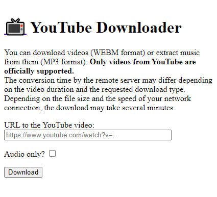

# 📺 YouTube Downloader

## In French

> [!IMPORTANT]
> Depuis mars 2026, le code du projet est désormais hébergé sur mon instance GitLab personnalisée, accessible à [cette adresse](https://git.florian-dev.fr/floriantrayon/YouTube-Downloader). Le dépôt GitHub est un miroir du dépôt GitLab, **mis à jour automatiquement**.
>
> **Les contributions publiques restent sur GitHub et sont les bienvenues** ; les pull requests validées y seront ensuite transférées manuellement sur GitLab pour être intégrées. 🙂

### Introduction

Ce petit site Internet permet de fournir une interface simple et fonctionnelle aux personnes voulant se servir de [YouTube-DL](https://github.com/ytdl-org/youtube-dl) (ou [YT-DLP](https://github.com/yt-dlp/yt-dlp)) pour télécharger ou extraire l'audio des vidéos YouTube sous différents formats et différentes qualités. Pour accélérer le processus de convertion et de téléchargement, le serveur peut garder une copie des fichiers convertis pour pouvoir l'envoyer aux clients si nécessaire.

> [!NOTE]
> Tout ou partie du code peut contenir des commentaires dans ma langue natale (le français) afin de faciliter le développement. 🌐

### Installation

- Installer [PHP LTS](https://www.php.net/downloads.php) (>8.2 ou plus) ;
- Installer [Python 3](https://www.python.org/downloads/), [PIP](https://pypi.org/project/pip/), [FFmpeg](https://www.ffmpeg.org/download.html) et [YouTube Downloader](https://github.com/yt-dlp/yt-dlp/wiki/Installation) (YT-DLP) ;
- Installer le module `mutagen` de Python avec la commande `pip install mutagen` ;
- Installer les extensions PHP additionnelles suivantes : `zip`, `opcache` ;
- Installer les dépendances du projet avec la commande `composer install` ;
- Utiliser un serveur Web pour servir les scripts PHP et les fichiers statiques.

> [!TIP]
> Pour tester le projet, vous pouvez utiliser [Docker](https://www.docker.com/). Une fois installé, il suffit de lancer l'image Docker de développement à l'aide de la commande `docker compose -f compose.development.yml up --detach --build`. Le site devrait être accessible à l'adresse suivante : http://localhost/. 🐳

> [!CAUTION]
> Le déploiement en environnement de production (**avec ou sans Docker**) **nécessite des connaissances approfondies pour déployer, optimiser et sécuriser correctement votre installation** afin d'éviter toute conséquence indésirable. ⚠️

## In English

> [!IMPORTANT]
> Since March 2026, the project's code has been hosted on my custom GitLab instance, accessible at [this address](https://git.florian-dev.fr/floriantrayon/YouTube-Downloader). The GitHub repository is a mirror of the GitLab repository, **automatically kept up to date**.
>
> **Public contributions remain on GitHub and are welcome**; validated pull requests will then be manually transferred to GitLab to be integrated. 🙂

### Introduction

This simple website provides a convenient and functional interface for people looking to use [YouTube-DL](https://github.com/ytdl-org/youtube-dl) (or [YT-DLP](https://github.com/yt-dlp/yt-dlp)) to download or extract audio from YouTube videos in different formats and quality levels. In order to speed up the conversion and upload process, the server can keep a copy of the converted files to send to the clients if necessary.

> [!NOTE]
> All or part of the code may contain comments in my native language (French) to ease development. 🌐

### Setup

- Install [PHP LTS](https://www.php.net/downloads.php) (>8.2 or higher) ;
- Install [Python 3](https://www.python.org/downloads/), [PIP](https://pypi.org/project/pip/), [FFmpeg](https://www.ffmpeg.org/download.html) and [YouTube Downloader](https://github.com/yt-dlp/yt-dlp/wiki/Installation) (YT-DLP) ;
- Install the `mutagen` Python module with the command `pip install mutagen` ;
- Install the following additional PHP extensions: `zip`, `opcache` ;
- Install project dependencies using `composer install` ;
- Use a web server to serve PHP scripts and static files.

> [!TIP]
> To test the project, you can use [Docker](https://www.docker.com/). Once installed, simply start the development Docker image using the command `docker compose -f compose.development.yml up --detach --build`. The website should then be accessible at the following address: http://localhost/. 🐳

> [!CAUTION]
> Deploying in a production environment (**with or without Docker**) **requires advanced knowledge to properly deploy, optimize, and secure your installation** in order to avoid any unwanted consequences. ⚠️

